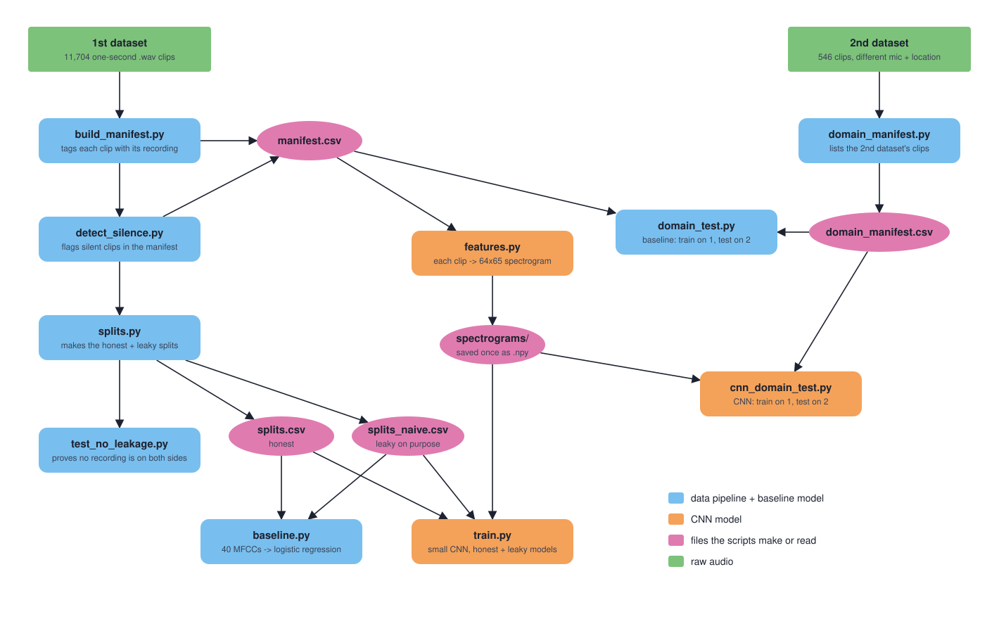

# Drone Acoustic Detection
[Supporting Doc](https://docs.google.com/document/d/1spNegbq3fJYjnkqIqJ_GkmG4IBpcOqkOcpvHhn9j29M/edit?usp=sharing)

A model that listens to a one second audio clip and says whether there's a drone in it. It's a CNN trained on spectrograms (pictures of sound), plus a simpler baseline model to compare it against.

The big thing I care about is testing it honestly. The main dataset has 11,704 clips, but they're all chopped from only about 122 real drone recordings. If one second of a recording ends up in training and the next second ends up in testing, the model has basically already heard the answer. So every clip gets tagged with the recording it came from, and the honest split keeps a whole recording on one side. I also make a leaky split on purpose, so I can show the difference.

## How it all fits together



Blue is the data pipeline and the baseline model, orange is the CNN. The editable version is `docs/pipeline.drawio` (open it at [app.diagrams.net](https://app.diagrams.net)).

## Results so far

| | Baseline (logistic regression) | CNN |
|---|---|---|
| Honest split PR-AUC | 0.9510 | 0.9894 |
| Leaky split PR-AUC | 0.8973 | 0.9645 |
| Mixed clips, honest split (drone with noise on top) | 60% (60/100) | 83% (83/100) |
| 2nd dataset PR-AUC | 0.9990 | 1.0000 |
| 2nd dataset, drones caught at the 50% cutoff | 29% (80/273) | 27% (74/273) |

PR-AUC is how well it ranks drones above non drones, 1.0 is perfect. I use it instead of accuracy because 88% of the clips have no drone, so a model that just says "no" every time would get 88% and learn nothing.

The CNN beats the baseline everywhere except recall on the 2nd dataset, so a better model fixed the ranking but not the cutoff. On audio from a new mic and location it still ranks every drone above every non drone, it just scores them too low to clear 50%.

## Setup

I built and tested it on Python 3.14.

```bash
git clone https://github.com/mi6uelange7/DroneAcousticDetection
cd DroneAcousticDetection
python3 -m venv .venv
source .venv/bin/activate
pip install -r requirements.txt
```

If you have an NVIDIA GPU and want training to go faster, install the CUDA version of PyTorch from [pytorch.org](https://pytorch.org/get-started/locally/). It runs fine on a regular CPU too, just slower.

## Getting the data

The audio isn't in this repo, it's too big. Everything goes in a `data/` folder, which git ignores.

**1st dataset** ([saraalemadi/DroneAudioDataset](https://github.com/saraalemadi/DroneAudioDataset)). You only need the `Binary_Drone_Audio` folder, about 400 MB:

```bash
mkdir -p data && cd data
git clone --depth 1 --filter=blob:none --sparse https://github.com/saraalemadi/DroneAudioDataset
git -C DroneAudioDataset sparse-checkout set Binary_Drone_Audio
cd ..
```

**2nd dataset** ([pcasabianca/Acoustic-UAV-Identification](https://github.com/pcasabianca/Acoustic-UAV-Identification)). The audio is on Dropbox, linked from their README. Download `Recorded Audios.zip` (about 455 MB) into `data/`, then only pull out the `Real World Testing` folder:

```bash
mkdir -p data/domain_corpus
unzip "data/Recorded Audios.zip" 'Real World Testing/*' -d data/domain_corpus/extracted
```

When you're done it should look like this:

```
data/
  DroneAudioDataset/Binary_Drone_Audio/
    yes_drone/        1,332 clips
    unknown/         10,372 clips
  domain_corpus/extracted/Real World Testing/
    drone/              273 clips
    no drone/           273 clips
```

## Running it

`manifest.csv`, `splits.csv`, `splits_naive.csv` and `domain_manifest.csv` are already in the repo, so you can skip straight to step 2. Step 1 is only if you want to rebuild them from scratch.

**1. Rebuild the manifest and splits (optional)**

```bash
python build_manifest.py data/DroneAudioDataset/Binary_Drone_Audio
python detect_silence.py data/DroneAudioDataset/Binary_Drone_Audio
python splits.py manifest.csv
python domain_manifest.py data/domain_corpus/extracted
```

**2. Check the honest split doesn't leak**

```bash
python -m pytest tests -v
```

All 4 should pass. The last one checks that the leaky split still leaks, because if it ever stopped, the comparison would be meaningless.

**3. Baseline model**

```bash
python baseline.py data/DroneAudioDataset/Binary_Drone_Audio
python domain_test.py data/DroneAudioDataset/Binary_Drone_Audio manifest.csv data/domain_corpus/extracted domain_manifest.csv
```

A few minutes each, most of it is loading audio.

**4. CNN**

```bash
python features.py data/DroneAudioDataset/Binary_Drone_Audio
python train.py
python cnn_domain_test.py
```

`features.py` turns every clip into a spectrogram and saves them to `data/spectrograms/`, so it only has to happen once. Then `train.py` trains one model on the honest split and a separate one on the leaky split. `cnn_domain_test.py` trains on all of the 1st dataset and tests on the 2nd. Each training run is 15 epochs (15 passes through the data). On an NVIDIA GPU it's under a minute, on my M1 MacBook it's about 2.5 minutes for train.py and 1.5 for cnn_domain_test.py, on plain CPU around 6.

## What each file does

| File | What it does |
|---|---|
| `build_manifest.py` | Goes through the audio and tags every clip with the recording it was cut from. Writes `manifest.csv`. |
| `detect_silence.py` | Flags clips that are pure silence. Adds a `silent` column instead of deleting them, so results can be run with and without. |
| `splits.py` | Makes the honest split (`splits.csv`) and the leaky one (`splits_naive.csv`). |
| `tests/test_no_leakage.py` | Proves no recording lands on both sides of the honest split. |
| `baseline.py` | Simple model. Squashes each clip into 40 numbers (MFCCs) and draws a line between drone and not drone with logistic regression. |
| `domain_manifest.py` | Lists the 2nd dataset's clips in the same format. |
| `domain_test.py` | Baseline trained on the 1st dataset, tested on the 2nd. |
| `features.py` | Turns each clip into a 64x65 mel spectrogram and caches it. |
| `train.py` | The CNN. 3 layers that scan the spectrogram for patterns, then zoom out. Trains honest and leaky models. |
| `cnn_domain_test.py` | CNN trained on the 1st dataset, tested on the 2nd. |

## Known issues / what's next

- **No random seed yet.** The CNN starts from random weights, so the numbers move every run. Some move a lot: drones caught on the 2nd dataset was 27% on one run and 83% on another, while PR-AUC stayed at 1.0000 both times. So the ranking is solid but the cutoff results aren't trustworthy from one run. Setting a seed and running it a few times is next.
- **The 50% cutoff is too high on new audio.** The model ranks drones right but scores them low on the 2nd dataset. Need to pick a better cutoff using training data only, not by looking at the test results.
- **Mixed clips might leak a little.** The mixed clips are the clean recordings with noise layered on top, but they're their own groups. So a clean recording could be in training while its noisy copy is in testing. Checking that next.
- **Training data is all one mic in one room.** Probably why it's under confident on the 2nd dataset. More varied audio or augmentation would help.
- **Stretch goal:** detecting human voices buried under drone noise, for search and rescue.
